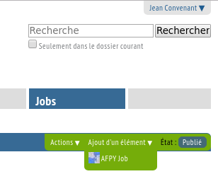

===================
Foire aux questions
===================

Votre compte sur AFPy.org
=========================

Intérêt
-------

Être membre permet :

- de payer vos cotisations et savoir si vous êtes à jour,
- et pour les membres professionnels d'avoir accès aux services premium tels que l'accès à notre fil d'annonces professsionnelles.

comment?
---------

- Remplissez ce formulaire_. Puis validez votre compte en cliquant sur le lien que vous recevrez par email.
- Ensuite, remplissez le formulaire d'adhésion_ après vous être créé un compte.
- Et pensez à rester à jour de vos cotisations :)

.. _formulaire: http://www.afpy.org/membres/register
.. _adhésion: http://www.afpy.org/membres/adhesion

J'ai perdu mon mot de passe. Que faire ?
----------------------------------------

Vous pouvez changer votre mot de passe en passant par ici_.

.. _ici: http://www.afpy.org/membres/password

Comment puis-je poster une offre d'emploi ?
-------------------------------------------

Après vous être créé un compte, allez sur l'onglet ``Jobs``

En utilisant le menu ``Ajout d'un élément``, ajoutez un ``AFPy Job``:

Remplissez les champs puis enregistrez.

Vous devez attendre qu'un admin publie votre job

Divers
======

Listes de diffusion de l'AfPy
-----------------------------

Vous pouvez souscrire aux `listes de diffusion <http://lists.afpy.org/>`_
qu'héberge l'association

Les adhérents sont automatiquement abonnés à la liste des membres de
l'association.

Combien y a-t-il de membres à l'AFPy ?
---------------------------------------

Vous pouvez avoir une idée en regardant la carte_

.. _carte: http://www.afpy.org/membres/carte

J'ai trouvé un bug sur le site de l'AFPy
------------------------------------------
Faites un rapport de bug sur: https://github.com/AFPy/site-web/issues

Je n'ai pas trouvé la réponse à ma question
---------------------------------------------------------------------------

Venez poser votre question sur notre salon de :doc:`clavardage` ou envoyez un
email à ``www at afpy dot org`` contenant votre question.
